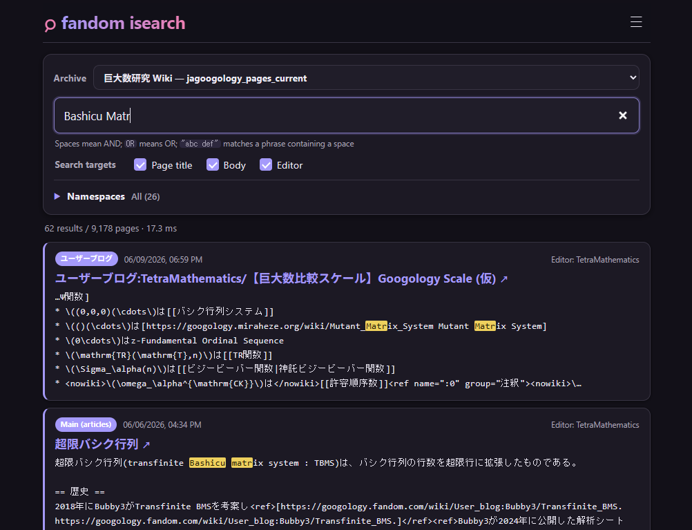

[← Back](../README.md) | [English](README.md) | [Japanese](README-ja.md)

# fandom-isearch

fandom-isearchはFandom（MediaWiki）のXMLアーカイブをローカルのSQLite DBに変換し、ブラウザまたはターミナルでインクリメンタル検索するツールです。ページタイトル、本文、編集者を対象に、日本語を含む部分一致検索ができます。



[(スクリーンショットの著作権は CC-BY-SA 3.0)](https://googology.fandom.com/ja/wiki/%E5%B7%A8%E5%A4%A7%E6%95%B0%E7%A0%94%E7%A9%B6_Wiki:%E8%91%97%E4%BD%9C%E6%A8%A9)

## DBを作る

Fandom Wiki IDを指定すると、最新のCurrent pagesアーカイブをダウンロードしてDBまで一括で作成します。

```console
$ ./makedb googology
```

自動ダウンロードには`7z`、`7zz`、`7zr`コマンドのいずれか、またはPythonの`py7zr`パッケージが必要です。

```console
$ python3 -m pip install -r requirements.txt
```

手元にあるアーカイブから作成することもできます。

```console
$ ./makedb data/jagoogology_pages_current.xml
```

生成物は`web/db/<XMLファイル名>.db`です。`.xml.gz`と`.xml.bz2`も直接読み込めます。`makedb`を再実行すると同名のDBがアトミックに置き換わります。

SQLite WebAssemblyは`file://`では動作しないため、同梱のローカルHTTPサーバー経由で`index.html`を開きます。

```console
$ ./serve
fandom-isearch: http://127.0.0.1:8000/
```

ブラウザで<http://127.0.0.1:8000/>を開いてください。別のポートを使う場合は、例えば`./serve 8080`とします。

## Agent・ターミナル用CLI

`fandom-search`は`findmine`と同様に、引数ありではワンショット検索、TTYで引数なしならcursesによるインクリメンタル検索になります。

```console
$ ./fandom-search グーゴル --limit 10
$ ./fandom-search '巨大 数' --url
$ ./fandom-search                         # 対話検索
```

検索対象は`--target`（別名：`--search-target`）を繰り返して指定できます。値を省略すると選択肢を一覧表示します。

```console
$ ./fandom-search --search-target
検索対象  説明
title     ページタイトル
body      本文
author    編集者

$ ./fandom-search Kyodaisuu --target author
$ ./fandom-search 巨大数 --target title --target body
```

名前空間は`--name-space`（別名：`--namespace`）を繰り返して指定できます。名前とIDのどちらでも指定できます。値を省略すると、選択したDB内の名前空間とページ数を一覧表示します。

```console
$ ./fandom-search --name-space
$ ./fandom-search 巨大数 --name-space '標準（記事）'
$ ./fandom-search 巨大数 --name-space 0 --name-space 500
```

CLIは初期状態で`web/db/databases.json`の先頭を選択します。別のDBは`--db web/db/example.db`で指定できます。どこからでも呼び出す場合は、実体のスクリプトへシンボリックリンクを作成します。

```console
$ ln -s "$(pwd)/fandom-search" ~/bin/fandom-search
```

## 検索UIと構文

- ページタイトル、本文、編集者を個別に検索対象として有効化できます。
- 名前空間は複数選択できます。初期状態は全選択で、一覧はデフォルトで折り畳まれています。
- 選択したDBに実際にページが存在する名前空間だけを表示します。
- 空白区切りはAND検索、未引用の大文字`OR`はOR検索、`"abc def"`は空白を含むフレーズ検索です。明示的な`AND`も使用できます。
- 3文字以上の検索にはSQLite FTS5 trigram索引を使い、1〜2文字では部分一致検索へフォールバックします。
- 最大200件を更新日時の新しい順に表示します。
- 複数のDBを作ると、画面にアーカイブ選択が追加されます。
- プロジェクトの著作権ページからCreative Commonsライセンスを特定できた場合、選択中アーカイブのライセンスと根拠ページをフッターに表示します。この表示はコメント・ディスカッションを対象にしません。

ブラウザは`navigator.language`を判定します。`ja`で始まるロケールなら日本語、それ以外は英語を使用します。テスト時は`?lang=en`または`?lang=ja`でブラウザロケールより優先できます。未対応の`lang`値は自動判定へフォールバックします。ターミナルCLIは`LC_ALL`、`LC_MESSAGES`、`LANGUAGE`、`LANG`に同じ自動判定規則を適用します。ツールが生成するUI、ヘルプ、状態、エラーメッセージは翻訳し、アーカイブ由来の名前空間名とページ内容は原文のまま表示します。

検索語、DB、検索対象、名前空間はURLに反映されるため、コピーしたURLから同じ検索を再現できます。初期状態でONの項目はURLに出さず、OFFにした例外だけを記録します。例えば編集者と名前空間500を無効化した場合は次のようになります。

```text
?q=巨大数&db=jagoogology_pages_current.db&exclude=author&excludeNs=500
```

全チェックボックスがONなら`exclude`と`excludeNs`はどちらも付きません。全項目をOFFにした場合は全値が列挙されます。ダークモードと名前空間パネルの開閉状態はブラウザの`localStorage`に保存されます。

## 保存するデータ

XMLの各ページから次の値をDBへ保存します。

- ページID、名前空間、ページタイトル、本文
- 最新リビジョンの編集者、リビジョンID、更新日時
- サイト名、記事URLの基点、MediaWikiバージョン、プロジェクトの著作権ページから特定したCreative Commonsライセンスなどのメタデータ

編集コメント（リビジョンの編集要約）は保存・検索しません。

## 必要環境

- Python 3.9以降
- Fandom Wiki IDからダウンロードする場合は7-Zipまたは`py7zr`
- FTS5およびtrigram tokenizerが有効なPython標準SQLite
- WebAssemblyを利用できるモダンブラウザ

フロントエンドはビルド不要のHTML、CSS、JavaScriptです。SQLite WebAssemblyは`web/vendor/`に同梱しています。
